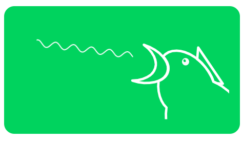

# bird-garden

> Synthesizing Bird Squawk & Song



## Overview

A project to get familiar with the [Tone.JS](https://tonejs.github.io/) library and broader [Web Audio API](https://developer.mozilla.org/en-US/docs/Web/API/Web_Audio_API). This is essentially a JavaScript port of a [Pure Data](http://puredata.info/) patch laid out in the "Birdcall Synthesis" article linked below. Between the two architectures in that article, this is an implementation of the first which less expressive but simpler to implement.

The core of this project is in the file `client/bird-classes.js` which includes  `Bird`, `BirdVoice` , `FreqMod` and `AmpMod` classes and the global `masterVolume` and `masterReverb` audio nodes. The main challenge was to define modules and interfaces to organize the audio nodes. 

There are two main flows of control - one is a randomized `setTimeout()` call that inspires the bird to chirp, the other comes from user interaction with the HTML "range" `input` elements which each produce a number between 0 and 1 and change parameters of the bird's voice. Scaling these values to the appropriate frequencies, time constants or amplitudes and mapping the scaled values to the correct audio nodes was a challenge here and resulted in a TON of getters and setters on the classes and a generally bloated namespace. There must be a more elegant and concise way to achieve this routing.

One quirk of this project and working with the Web Audio API is that user interaction is generally required to start the audio as outlined [in this issue](https://github.com/Tonejs/Tone.js/issues/341). Here that is achieved with an event listener attached to the volume slider in `bird-action.js` . When the slider is moved a new `Bird` instance is created and the bird starts chirping. I found that resuming the audio context caused an initial unpleasant clicking sound so a `setTimeout()` call is used to unmute the master volume node and kick off the chirping after 2 seconds (usually long enough to avoid the click).

## Future possibilities

- Presets
  - Suptle tweaks of modulation can produce some pretty distinct sounds - it would be great to implement a way to save and recall a collection different voices.
- Flock
  - The benefit of creating a class based design is that many birds can be created from the same prototype, with presets implemented the next step is to instantiate a whole flock of birds.

## Usage

```bash
# Clone repo and change into the new directory
git clone https://github.com/jaredellison/bird-garden && cd bird-garden

# Install dependencies
npm install

# Start development server
npm start
```

User interaction is required to start audio playback: turn up the volume to start playing.

## Inspiration and Resources

- [Birdcall Synthesis: Avian Anatomy to Avian Audio](https://web.archive.org/web/20150303020554/http://www.obiwannabe.co.uk/tutorials/html/tutorial_birds.html)
- [Hans Mikelson's article in CSound Magazine Winter 2000:  "Real-time: Bird Calls"](https://web.archive.org/web/20120531040558/http://www.csounds.com/ezine/winter2000/realtime/index.html)
- [Andy Farnell's Designing Sound](https://mitpress.mit.edu/books/designing-sound)

## Authors

- **Jared Ellison** - [jaredellison.net](http://jaredellison.net/)

